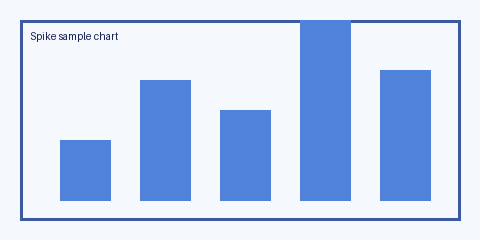

# H1: Spike Test Document

This is a paragraph with **bold text** and `inline code` to verify inline formatting renders correctly after Drive's HTML→Doc conversion.

## H2: Section heading

### H3: Subsection

#### H4: Deeper heading

A second paragraph follows the heading.

## H2: Bullet list

- First item
- Second item with **bold inline**
- Third item with `inline code`
  - Nested bullet (whether nesting survives is interesting)

## H2: Ordered list

1. One
2. Two with **bold**
3. Three

## H2: Blockquote

> This is a blockquote. It should render with an indent or a left bar.
> Continuation line in the same quote.

## H2: Code block

```python
def hello(name: str) -> str:
    """Greet the caller."""
    return f"Hello, {name}!"


if __name__ == "__main__":
    print(hello("world"))
```

## H2: Horizontal rule

Above the line.

---

Below the line.

## H2: Table

| Column A | Column B    | Column C    |
| -------- | ----------- | ----------- |
| a1       | b1          | **bold c1** |
| a2       | `code b2`   | c2          |
| a3       | longer text | c3          |

## H2: Image



A paragraph following the image.
