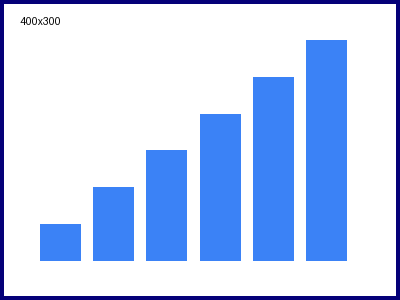

# Style Sample — md-to-gdoc

Body paragraph with **bold**, *italic*, ~~strikethrough~~, `inline code`, a [link](https://example.com), and a bare URL https://example.com/linkify.

日本語の本文です。`inline_code` を含む行と **太字** の確認。Japanese body text falls back to a CJK font.

## H2 Heading

### H3 Heading

#### H4 Heading

##### H5 Heading

###### H6 Heading

## Lists

- Tight bullet level 1
  - Level 2
    - Level 3
- Another level 1 item

- Loose bullet item

  Continuation paragraph that should stay indented under the bullet.

- Second loose item

1. Ordered first
2. Ordered second
   1. Nested ordered
      1. Third level ordered
3. Ordered third
   - Bullet nested under ordered
   - Another bullet

## Table

| Metric | Value | Note |
|---|---:|---|
| Spend | 12,345 | `campaign_a` |
| Installs | 678 | **bold cell** |
| CPI | 18.21 | *italic cell* |
| D7 ROAS | 0.42 | [link](https://example.com) |
| Retention | 31% | plain |
| CTR | 1.2% | last row |

## Blockquote

> A single-line blockquote with `inline code` inside.

## Code block

```python
def hello(name: str) -> str:
    # comment line
    return f"Hello, {name}"
```

SQL with multi-line comments:

```sql
/*
 * Daily spend by campaign (JP only).
 * Multi-line block comment: indentation and the leading asterisks
 * must be preserved as-is.
 */
SELECT
  campaign_id,
  DATE(timestamp, 'Asia/Tokyo') AS date_jst,  -- trailing line comment
  SUM(gross_spend_usd) AS spend_usd
FROM `project.dataset.table`
-- Consecutive line comments:
-- 1) exclude test campaigns
-- 2) limit to the last 7 days
WHERE country = 'JPN'
  AND timestamp >= TIMESTAMP_SUB(CURRENT_TIMESTAMP(), INTERVAL 7 DAY)
GROUP BY 1, 2
ORDER BY spend_usd DESC  /* inline block comment */
```

## Images

Narrow image (should keep intrinsic size):



Wide image (should be capped at the content width):


---

Text after the horizontal rule.
